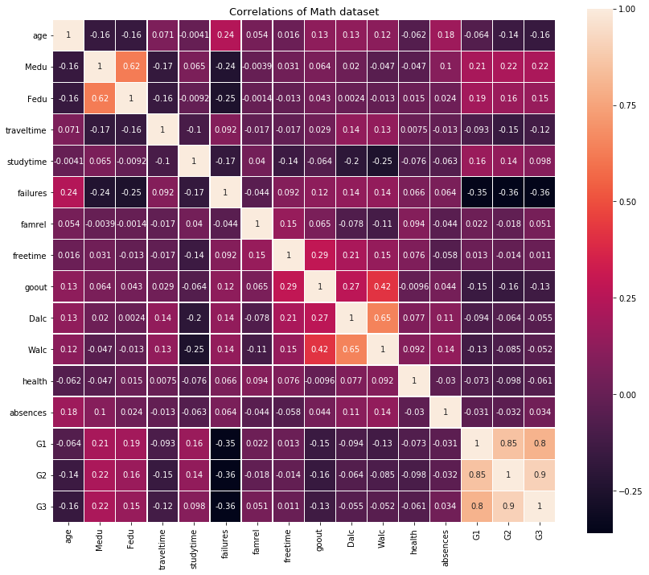

# Data-Portfolio
Portfolio projects completed by Zahier Nasrudin. Click on the projects to see full analysis and code.

 
## Projects (R-Studio):

###  [Data Visualization (Emplyoment and Unemployment Rate in Malaysia)](https://mhdzahier.github.io/Employment%20and%20Unemployment%20in%20Malaysia.html#employment)
* Employment (1982 to 2017)
* Employment vs Unemployment (2011 to 2016)
* **Keywords**(Rstudio, Data Visualization, Employment, Unemployment)

 
---

###  [Wisconsin Breast Cancer Prediction](https://htmlpreview.github.io/?https://github.com/mhdzahier/Wisconsin-Breast-Cancer-Prediction/blob/master/Wisconsin%20Breast%20Cancer%20Analysis.html)
* Prediction using 6 Machine Learning Algorithms
* **Keywords**(Rstudio, Machine Learning, Wisconsin Breast Cancer)

 
---

###  [Stock Market Time Series Analysis](https://github.com/mhdzahier/Data-Portfolio/blob/master/Stock%20Market%20Time%20series%20analysis%20using%20R-Studio.pdf)
* Time Series Plots of AAL,ADS, M0 and PWR stock market prices.
* **Keywords**(R-Studio)

 
 
---

###  [Bootstraping and Simulation using German Credit Risk Dataset](https://drive.google.com/file/d/1kkJ8qY2GmhNr41hv20GLA2MDqE5MtJ-G/view?usp=sharing)
* Fit a Logistic Regression Model
* Perform bootstrap on the coefficients of logistic regression model
* Construct 95% Confidence Intervals for the parameters of bootstrap model
* Perform simulation of coefficients
* Calculate the predictive probabilities of 1000 simulations
* **Keywords**(R-Studio, Bootstrap, Simulation)

 
 
---

## Projects (Python):

###  [Exploratory Data Analysis](https://github.com/mhdzahier/mhdzahier.github.io/blob/master/Exploratory%20Data%20Analysis%20(Student%20Performance%20Dataset).ipynb)
* Perform Exploratory Data Analysis on Student Performance Dataset
* **Keywords**(Python, EDA)

 
 
---

